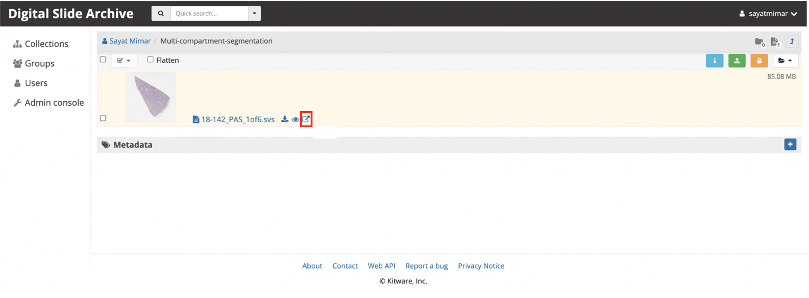
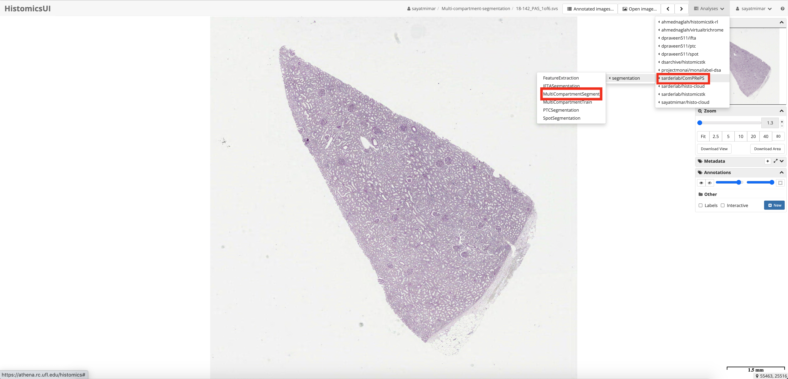
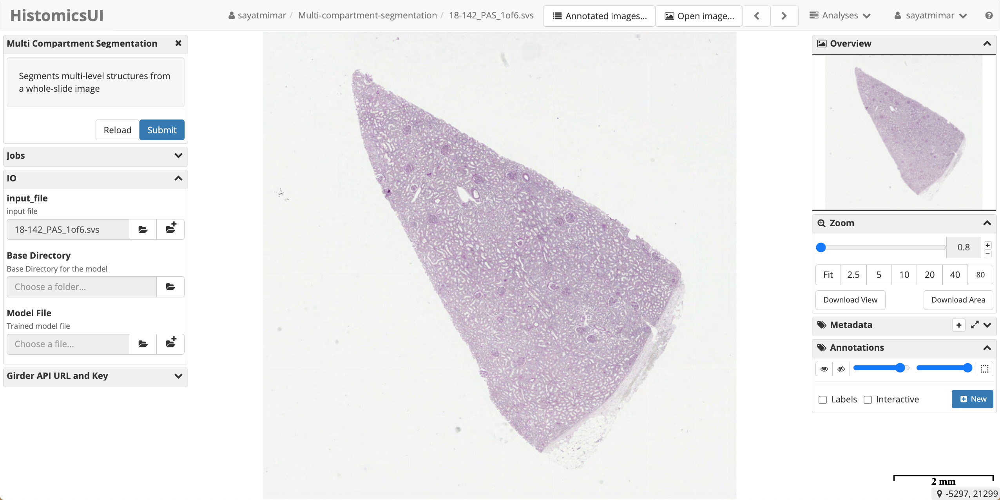

# Multi Compartment Segmentation

Multi compartment segmentation is a [detectron2](https://github.com/facebookresearch/detectron2) based panoptic segmentation model that is implemented as a pipeline in [Digital Slide Archive](https://athena.rc.ufl.edu/) (DSA) developed and maintained by [CMI lab](https://cmilab.nephrology.medicine.ufl.edu/) at the University of Florida. This DSA plugin allows users to segment a kidney Whole Slide Image (WSI) into 6 compartments, namely: cortical interstitium, medullary interstitium, non-sclerotic glomerulus, sclerotic glomerulus, tubule, and artery/arteriole.

## Quick Start Guide

This DSA plugin allows users to run image analysis jobs through the HistomicsUI by the following steps:

1. Create an account at [DSA](https://athena.rc.ufl.edu/) and log in with your credentials.
2. Upload a WSI in a folder either unders Collections tab or in your User directory
3. Open the image in HistomicsUI by clicking the arrow icon:

4. From **Analyses** tab on the top right in HistomicsUI select: sarderlab/ComPRePS/segmentation/MultiCompartmentSegment

5. Populate the fields in the tab that appears on the left side of the page: Select the Base Directory as the directory where your WSI is located and select the Model File from the Collections/models/segmentation_models/Multi_compartment_model with an available pre train model and click Sumbit botton.

6. Once the job sucessfuly runs, the segmented compartments will appear on top of the image. You can visuazlie them all or one-by-one by selecting the layers you wish to view from Annotations/Other tab on the right.

# See Also

*Correlating Deep Learning-Based Automated Reference Kidney Histomorphometry with Patient Demographics and Creatinine* by Lucarelli N. *et. al.*

# Contact

Sayat Mimar (SWE): sayat.mimar@ufl.edu\
Pinaki Sarder (PI): pinaki.sarder@ufl.edu

